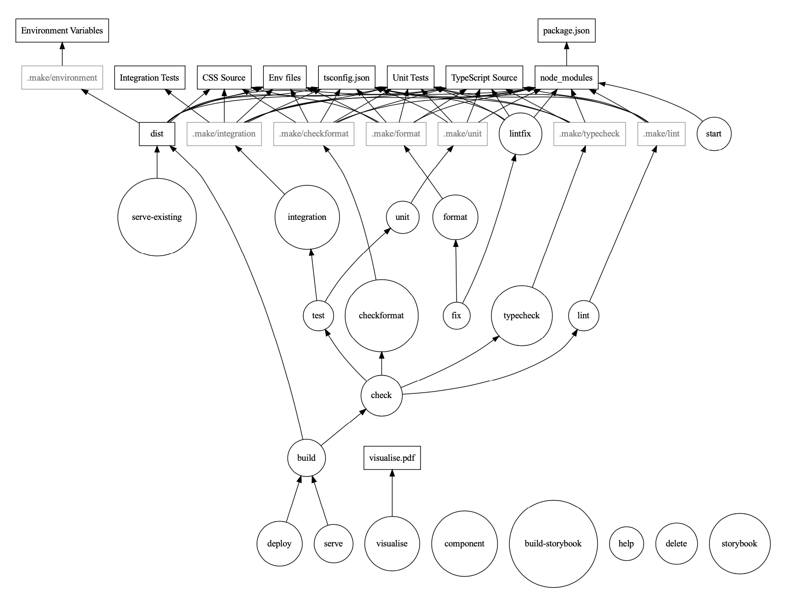

# baseline 🏁

A pretty good template for a React app.

Some features it has so far:

- Build/Deploy/Test scripts in a Makefile
- Fast builds with Vite
- Hot module reloading
- Unit tests with Jest
- Feature flags with Flagsmith
- Linting with ESLint
- Autoformatting with Prettier
- Routing with React-Router (v6)
- Styling with Tailwind (v3, with JIT)
- Precommit hooks with Husky to check linting, formatting and tests
- Integration tests with Playwright
- Visualised dependencies with GraphViz
- Crash reporting with Rollbar
- Code splitting with React.lazy()

## Makefile

Using a Makefile is probably the most controversial choice here. This is done for a
few reasons, such as:

- Ease of chaining together operations (e.g. `make lintfix format test`)
- Only running dependencies when needed.
- Parallel builds

This setup looks intimidating, but I've listed some examples of how to interpret the graph below.



### Example 1: Building & Serving the App

1. Run `make serve`
2. `serve` depends on the app having been built, aka the `build` job.
3. `build` depends on a code quality `check`, and then creates the `dist` folder.
4. `check` runs `test`ing, `lint`ing, `typecheck`ing, and `checkformat`ing on the codebase
5. `test` runs both `unit` and `integration` tests.
6. `unit` tests rely on the files marked as `Unit Tests`, the `node_modules`, and the `TypeScript Source` -- but they don't rely on the CSS source or the Env files, for example.

There's some magic here with the grayed-out file labeled `.make/unit`. This is a timestamp we create so that Make can see when we last ran unit tests, and compare that against the latest changes to the unit test files. If there are recent changes to the unit test files, we run the suite of unit tests again; if not, we can safely skip it!

### Example 2: Commit Hooks

1. Run `make check` while developing a new feature
2. Edit a CSS source file
3. Run `make serve` to run a file server.

Here, `make serve` depends on `build`, which depends on `check`. `check` will run both unit and integration tests. **However**, because `unit` doesn't depend on the CSS source files, Make knows we can safely skip it. We do re-run integration tests, since by using a library like Playwright we can check if our CSS changes have [obscured a previously-visible element](https://playwright.dev/docs/actionability).

## Interpreting the Makefile Graph

In this graph, round nodes are "phony" (i.e. they don't correspond to a real file), whereas rectangular nodes are real files like `package.json`, and Unit Tests.

I've grouped lots of these files together into a single node, which matches up with the way I've used variables in the Makefile. This makes things lots easier to read!

To interpret the graph, look at the bottom commands and what they depend on.
For example, running `make deploy` will depend on the `build` task. The `build` task in turn depends on `node_modules`, `test`, `typecheck`, `lint`, `checkformat`, and `dist`, and so on.

I've also got some greyed-out nodes which are real files, but probably not ones we care about. These are used to record the last time a command was run, e.g. when unit
tests last passed. This is useful since running tests might be a slow operation and
it's useful to skip it if the input files haven't changed.

## Parallel Builds

Parallel builds are a very new feature to me, so I'm not fully confident they're working as planned. It's quite possible that to support parallel builds, it'd make sense to avoid all mutating jobs (e.g. Prettier's `--write` and ESLint's `--fix`).

Unfortunately, all I have in front of me is a dual-core Intel machine, so...

```
$ time make -B build
...
make -B build  34.88s user 2.37s system 143% cpu 25.916 total

$ time make -Bj build
...
make -Bj build  35.86s user 2.73s system 173% cpu 22.263 total
```

## Future Features

- Format and lint fixing on commit (instead of just checking)
- Separate NPM package with a design system
- Develop with that package locally with hot reloading
- Scripts for running with local vs remote copy of design system package
- Automatic feature/demo branch deployment
- Create new API layer microservices with a single command
- Create new pages with a single command
- Code splitting
- Metrics reporting / usage
- Two-token authentication framework (e.g. Cognito, OAuth2)
- CMS/Authoring
- Prerender/skeleton build
- Multi-environment config (i.e. easy solution to create a new environment with a config)
